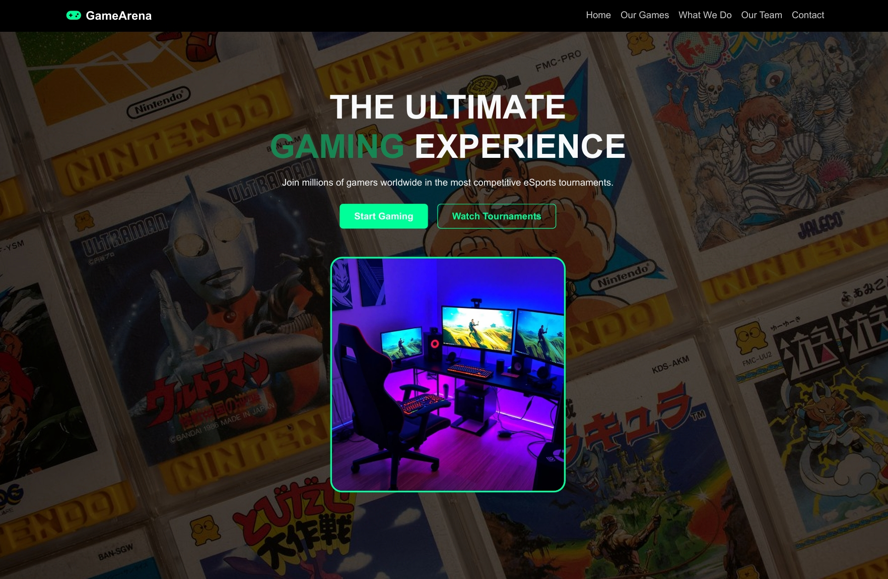
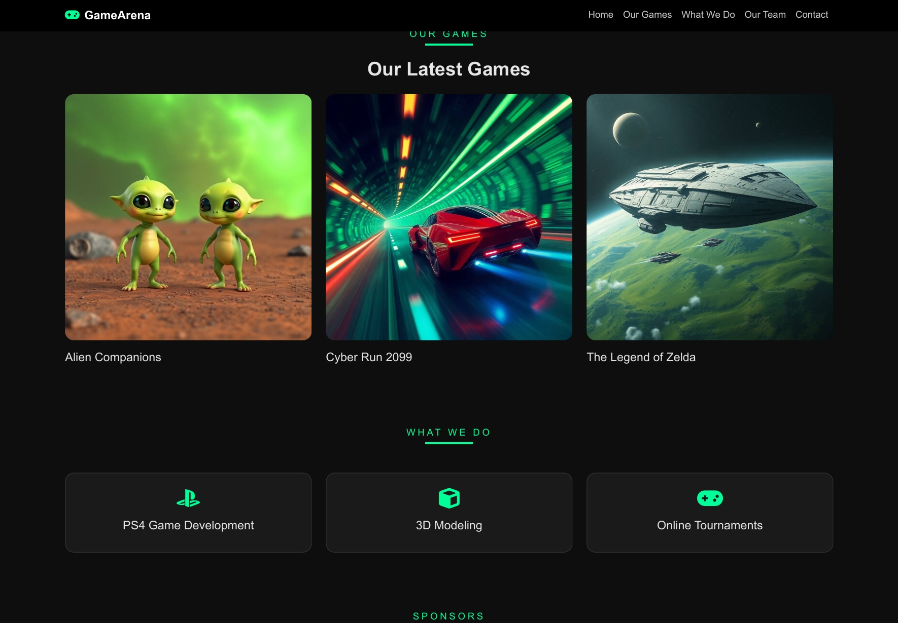
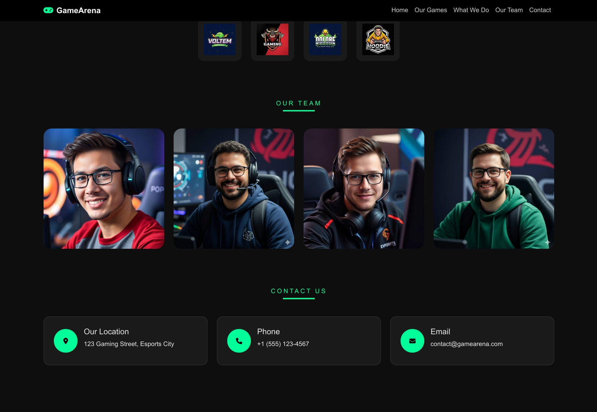

## Games Arena — Experimental Gaming Landing Page

Games Arena is an experimental, concept-driven landing page designed to explore creative front-end development techniques within a futuristic gaming theme.
This project is not a commercial product; it serves as a skill-testing environment to demonstrate visual design, layout structuring, image handling, and modern UI composition.

The interface was crafted with a dark neon aesthetic inspired by gaming platforms, focusing on high-impact visuals and smooth interactive elements to deliver a polished and immersive experience.

## Project Overview

Games Arena was created as a learning project to practice and refine front-end development skills. It integrates cinematic visuals, strong layout design, and thematic styling to showcase the ability to build a complete landing page with cohesive branding.

Although experimental, the project reflects real-world design principles and demonstrates how a digital gaming identity can be presented in a professional and visually engaging manner.

## Preview Images

## Key Features

## Cinematic Hero Section
A bold introductory layout featuring layered visuals, clear text hierarchy, and strong visual impact.

## Interactive Game Cards
Game previews include hover effects to create motion and enhance user engagement.

## Themed Service Highlights
A structured section showcasing fictional gaming-related services, demonstrating the ability to design brand-consistent components.

## Sponsor Wall
A clean grid of logos styled to mimic real eSports sponsorship arrangements.

## Team Presentation
Avatar cards with zoom and blur effects for a modern, immersive team section.

## Cohesive Visual Identity
A neon green and black color palette designed to reflect a futuristic gaming brand.

## Fully Responsive Layout
The design adapts properly across desktop, tablet, and mobile screens.

## Purpose of the Project

The primary objective of Games Arena is to serve as a practice environment to:
 • Strengthen UI/UX fundamentals
 • Explore creative layout structures
 • Develop consistency in theme-based design
 • Practice image usage and visual storytelling
 • Build a professional, portfolio-ready landing page

This website is intentionally experimental and not intended as a full gaming platform.
Its purpose is to demonstrate capability, creativity, and front-end development potential.

## Tech Stack

 • HTML5
 • CSS3
 • Bootstrap 5.3
 • Font Awesome

## Developer
Teef M. Karyry — TeefDev
